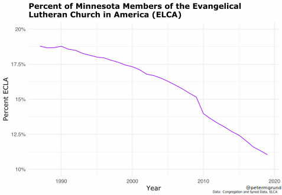
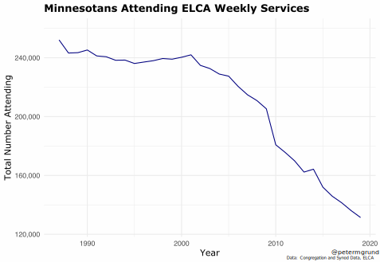
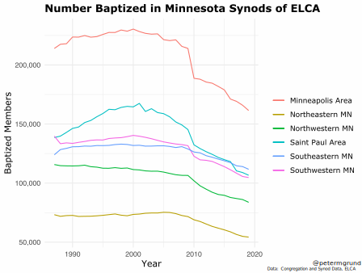
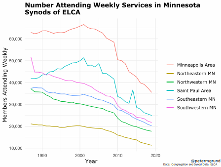
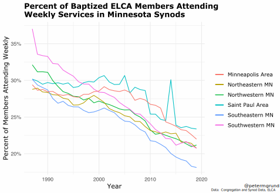

Few places in the U.S. are more associated with Lutheranism than Minnesota. Swedish, Norwegian, German, and other European settlers arriving in the mid- to late 19th and early 20th century brought with them their religious heritage and established distinct Lutheran congregations and church bodies based on ethnic identification. As decedents became more integrated into American culture, Lutheran bodies became less associated with specific national origins and prioritized common geography and theology.  In 1988, the largest and arguably most consequential merger occurred. The Evangelical [Lutheran Church in America](https://www.britannica.com/topic/Lutheran-Church-in-America) (ELCA) was formed from the [American Lutheran Church](https://www.britannica.com/topic/American-Lutheran-Church) and the [Lutheran Church in America](https://en.wikipedia.org/wiki/Lutheran_Church_in_America), making ELCA the largest Lutheran denomination in the United States.

At the time of the merger, Minnesota had the largest number of baptized ELCA members in the U.S. by raw numbers (805,000), or nearly 19% of the state's total population. 

Despite representing an impressive percent of the population, membership in ELCA has steadily declined in Minnesota over the past 3 decades. In 2019, only around 11% of Minnesotans were members. I want to explore in more detail what is happening to this once dominant religious body.

The graph below demonstrates that even since ELCA's formation, they have been declining as a percentage of the state. This is due to several reasons: the church's growth has always lagged behind Minnesota's population growth, an increase in domestic and international immigration of non-Lutherans, and since 2000, secularization, deaths outnumbering baptisms, and people leaving the church. 

Raw membership numbers help present a more nuanced story. ELCA numbers were slowly growing in MN until the turn of the century, at which point the trend reversed. The initial decline was due to a drop in baptisms relative to deaths, as well as moderate levels of resignations. The significant drop seen in 2009 can largely be attributed to the adoption of a same-gender relationship social policy. Starting in 2010, resignations and deaths vastly outnumbered the number of baptisms occurring per year, explaining the steep decline.

Between 2009 and 2010, ELCA lost over 57,000 members in MN, or around 7% of all members. Since then, they have been losing a little over 10,000 members per year.

Below, we can see that the number attending weekly ELCA services across MN remained steady up until 2000.

Now, let's look at regional differences. Minnesota is split into 6 separate synods. The number of members in each were remaining steady (and even growing in Saint Paul) as recently as 2001. The impact of the 2009 resolution can easily be seen in the Minneapolis Area Synod.

Shown below is the number of weekly attenders per synod. With headlines such as '[Will the ELCA be Gone in 30 Years?](https://faithlead.luthersem.edu/decline/)', it's shocking to me that congregations in the Minneapolis and Saint Paul Area were still growing just 20 years ago.

However, signs of decline could be seen earlier. The graph below shows the percent of baptized members attending weekly services. In '87, the average across all synods was about 30%. That has since dropped 10 pts.

These steep declines in overall participation in the Church suggest a bleak future for the ELCA in Minnesota. If trends continue, only a few thousand members will be attending weekly services in 2040, and hundreds of congregations will be forced to close. While certainly worrying for ELCA faithful, the Church is not alone in its decline: other mainline Protestant churches in the United States have also been bleeding members, such as the United Church of Christ, United Methodist Church, and the Episcopal Church. Even other Lutheran branches such as the Lutheran Church–Missouri Synod are experiencing similar problems. 

Unless the Church is able to retain its youngest members, who even so make up a small percentage of the currently attending population, the ELCA may no longer be the significant force in Minnesota's religious composition as it was historically.